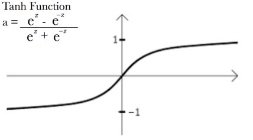

# Tutorial Flappy Bird con IA

## DOCUMENTACIÓN
- Neat : [https://neat-python.readthedocs.io/en/latest/]
- Pygame : [https://www.pygame.org/docs/]

1. Definir los objetos que se deben usar.
- Pajaro: Debido a que la solución se realiza con un algoritmo genetico se usan varias instancias de pajaros.
- Tubo: Son los obtaculos que encuentra el pajaro. Tienen movimiento posici,on y longotud.
- Suelo: El suelo al moverse se aprovecha la ventaja de la POO para crear metodos que permitan este efecto visual.

2. Crear el archivo .py 

3. Descargar las librerias
- pygame
- neat
- random
- os
- time

4. Crear las constantes para el tamaño de la ventana e importar las imagenes para volverlas elementos en una variable.

## Clase pajaro

5. Crear la clase Bird con sus constantes.

6. Crear el metodo init el cual tiene los atributos del pajaro
``` PYTHON
def __init__(self, x, y):
    self.x = x
    self.y = y
    self.tilt = 0  
    self.tick_count = 0 # Keeps track of the "time" passed since the bird moved
    self.velocity = 0
    self.height = self.y
    self.image_time_counter = 0
    self.current_image = self.IMAGES[0]  
```

7. Crear el metodo jump que se va a encargar del movimiento del pajaro en el eje y.

8. Crear el metodo move que se llama cada vez que se actualice el frame de la pantalla para actualizar la posición del pajaro.
```PYTHON
    def move(self):
        self.tick_count += 1 # One unit of time passsed

        dy = ( self.velocity*self.tick_count ) + ( 1.5 * self.tick_count**2 ) # Physics ecuation D = Vo*t + (a*t^2)/2

        if dy >= 16: # Trunk the change of displacement for visual effects
            dy = 16

        if dy < 0:
            dy = -2

        self.y += dy

        if dy < 0 or self.y < self.height + 50: # Bird moving up
            if self.tilt < self.ROTATION:
                self.tilt = self.ROTATION

        else: # Bird moving down
            if self.tilt > -90 : 
                self.tilt -= self.ROTATION_VELOCITY
```

9. Crear el metodo get_bird_image que me permite ver la imagen del pajaro para que esta sea renderizada en la pantalla

## Creación del juego

10. Crear la pantalla y el bucle principal del juego.
```PYTHON
    bird = Bird(150,150)
    window = pygame.display.set_mode((WINDOW_WIDTH,WINDOW_HEIGHT))
    run = True
    clock = pygame.time.Clock()

    while run:
        clock.tick(30)
        for event in pygame.event.get():
            if event.type == pygame.QUIT:
                run = False

        bird.move()
        update_window(window,bird)
    
    pygame.quit()
    quit()
```

## Creación del pipe

11. Crear la clase pipe con su metodo init.
```PYTHON
class Pipe():
    VELOCITY = 5
    GAP = 200

    def __init__(self,x):
        self.x = x
        self.PIPE_TOP = pygame.transform.flip(PIPE_IMAGE, False, True)
        self.PIPE_BOTTOM = PIPE_IMAGE
        
        self.height = random.randrange(50,400)
        self.top_pipe_position = self.height - self.PIPE_TOP.get_height()
        self.bottom_pipe_position = self.height + self.GAP
```

12. Crear el metodo move
```PYTHON
def move(self):
    self.x -= self.VELOCITY
```

13. Crear un metodo para retornar las imagenes de los pipe de modo que estas puedan ser renderizadas
```PYTHON
    def get_pipe_images(self):
        top_pipe = (self.PIPE_TOP, (self.x,self.top_pipe_position))
        bottom_pipe = (self.PIPE_BOTTOM, (self.x,self.bottom_pipe_position)) 
        return ( top_pipe , bottom_pipe )
```

## Juego
14. Crear metodo de detección de colisiones
```PYTHON
def check_collision(bird : Bird, pipe: Pipe):
    bird_mask = bird.get_mask()
    top_pipe_mask = pipe.get_top_pipe_mask()
    bottom_pipe_mask = pipe.get_bottom_pipe_mask()

    # Distances between bird pixels and pipe pixels
    top_offset = ( pipe.x - bird.x , pipe.top_pipe_position - round(bird.y) )
    bottom_offset = ( pipe.x - bird.x , pipe.bottom_pipe_position - round(bird.y) )

    # Check collision by checking if the pixels overlap
    top_colide = bird_mask.overlap(top_pipe_mask, top_offset)
    bottom_colide = bird_mask.overlap(bottom_pipe_mask, bottom_offset)

    if top_colide or bottom_colide:
        return True
    
    return False
```

## Creación de la clase Base
15. Crear la clase Base y su constructor
```PYTHON
class Base:

    IMAGE = BASE_IMAGE
    VELOCITY = 5

    def __init__(self, y):
        self.y = y
        self.x1 = 0
        self.x2 = self.IMAGE.get_width()
```

16. La base va a moverse hacia la izquierda y para poder implementar un efecto visual de una base infinita se van a concatenar dos imagenes de la base por lo cual se moveran por un metodo y habra una interfaz que nos permita recuperar la información de la posición en x de ambas bases

```PYTHON
    def move(self):
        self.pos_x_image_1 -= self.VELOCITY
        self.pos_x_image_2 -= self.VELOCITY

        if self.pos_x_image_1 + self.WIDTH < 0:
            self.pos_x_image_1 = self.WIDTH

        if self.pos_x_image_2 + self.WIDTH < 0:
            self.pos_x_image_2 = self.WIDTH

    def get_base_image_and_positions(self):
        pos_image_1 = (self.pos_x_image_1, self.pos_y)
        pos_image_2 = (self.pos_x_image_2, self.pos_y)

        return (self.IMAGE, pos_image_1, pos_image_2)
```

## Juego
17. Crear una lista de pipes y generar nuevos pipes cuando se pasen
18. Chekear colisiones del pajaro con los pipes o el suelo
```PYTHON
        pipes_for_remove = []
        add_pipe = False
        for pipe in pipes:
            pipe.move()
            
            if check_collision(bird, pipe):
               pass
                
            if pipe.x + pipe.PIPE_TOP.get_width() < 0:
                pipes_for_remove.append(pipe)
            
            if not pipe.passed and pipe.x < bird.x:
                pipe.passed = True
                add_pipe = True 

        if add_pipe : 
            score += 1
            pipes.append(Pipe(WINDOW_WIDTH + 100))

        for pipe in pipes_for_remove:
            pipes.remove(pipe)

        if bird.y + bird.current_image.get_height > 500:
            pass
```

19. Pintar el punatje
```PYTHON
pygame.font.init()
SCORE_FONT = pygame.font.SysFont("comicsans",50)
score_label = SCORE_FONT.render("Score: " + str(score),1,(255,255,255))
window.blit(score_label, (WINDOW_WIDTH - score_label.get_width() - 15, 10))
```


# Parte de inteligencia artificial
Para esta parte se usara el algoritmo de NEAT (Para mayor profundidad en el ver en las siguientes fuentes):
- [Paper de neat](http://nn.cs.utexas.edu/downloads/papers/stanley.cec02.pdf)
- [Documentacion oficial](https://neat-python.readthedocs.io/en/latest/)

Basicamente el modulo de NEAT nos permite constrir redes neuronales simples, que pueden crecer en complejidad automaticamente, para la solución de nuestros problemas de multiples variables.

## ¿ Que se necesita ?
- Entradas :  Las entradas son de las partes más importantes ya que de ellas depende el buen dieseño de nuestra red neuronal. Para nuestro Flappy bird que posibles entradas son convenientes:
    - La posición del pajaro en el eje y.
    - La distancia entre el pajaro y el tubo de arriba.
    - La distancia entre el pajaro y el tubo de abajo.
- Salidas :  Para nuestro pajaro el unico metodo de movimiento el metodo jump. Por lo cual la salida es una unica neurona que nos indica si se llama el metodo jump o no.

- Función de activción:

    
    - El uso de estas funciones de activación es para truncar el resultado de una neurona entre 1 y -1 (Algunas famosas son Sigmoid, relu, etc).

- Tamaño de la población: 100 PAJAROS. Este es el número de flappy birds por generación

- Fitness function: Es la parte más importante de nuestra red neuronal ya que esta define como los pajaros se van a hacer mejores. ¿Cómo evaluaremos si un pajaro lo esta haciendo bien?
    - Que tan lejos en el eje x llega el pajaro.

- Truncar el programa a un número finito de genraciones.

## Programación
1. Crear el archivo de configuración. La documentación se encuentra [aqui](https://neat-python.readthedocs.io/en/latest/config_file.html).
```
[NEAT]
fitness_criterion     = max
fitness_threshold     = 100
pop_size              = 50
reset_on_extinction   = False

[DefaultGenome]
# node activation options
activation_default      = tanh
activation_mutate_rate  = 0.0
activation_options      = tanh

# node aggregation options
aggregation_default     = sum
aggregation_mutate_rate = 0.0
aggregation_options     = sum

# node bias options
bias_init_mean          = 0.0
bias_init_stdev         = 1.0
bias_max_value          = 30.0
bias_min_value          = -30.0
bias_mutate_power       = 0.5
bias_mutate_rate        = 0.7
bias_replace_rate       = 0.1

# genome compatibility options
compatibility_disjoint_coefficient = 1.0
compatibility_weight_coefficient   = 0.5

# connection add/remove rates
conn_add_prob           = 0.5
conn_delete_prob        = 0.5

# connection enable options
enabled_default         = True
enabled_mutate_rate     = 0.01

feed_forward            = True
initial_connection      = full

# node add/remove rates
node_add_prob           = 0.2
node_delete_prob        = 0.2

# network parameters
num_hidden              = 0
num_inputs              = 3
num_outputs             = 1

# node response options
response_init_mean      = 1.0
response_init_stdev     = 0.0
response_max_value      = 30.0
response_min_value      = -30.0
response_mutate_power   = 0.0
response_mutate_rate    = 0.0
response_replace_rate   = 0.0

# connection weight options
weight_init_mean        = 0.0
weight_init_stdev       = 1.0
weight_max_value        = 30
weight_min_value        = -30
weight_mutate_power     = 0.5
weight_mutate_rate      = 0.8
weight_replace_rate     = 0.1

[DefaultSpeciesSet]
compatibility_threshold = 3.0

[DefaultStagnation]
species_fitness_func = max
max_stagnation       = 20
species_elitism      = 2

[DefaultReproduction]
elitism            = 2
survival_threshold = 0.2
```

- Red neuronal:
    

2. En el archivo flappy_bird.py configurar la ruta al archivo de configuración.
```PYTHON
if __name__ == "__main__":
    local_dir = os.path.dirname(__file__) 
    config_path = os.path.join(local_dir, 'config-feedforward.txt')

    config = neat.config.Config(neat.Def)
```

3. Crear una población
```PYTHON
if __name__ == "__main__":
    local_dir = os.path.dirname(__file__) 
    config_path = os.path.join(local_dir, 'config-feedforward.txt')

    config = neat.config.Config(neat.Def)

    population = neat.Population(config)
```

4. Agregar algunas estadisticas para ver en pantalla mientras se corren la simulaciones por generación
```PYTHON
if __name__ == "__main__":
    local_dir = os.path.dirname(__file__) 
    config_path = os.path.join(local_dir, 'config-feedforward.txt')

    config = neat.config.Config(neat.Def)

    population = neat.Population(config)

    population.add_reporter(neat.StdOutReporter(True))
    population.add_reporter(neat.StatisticsReporter())
```

5. Correr la funcion que se debe replicar por generación. En nuestro caso el main.
```PYTHON
winner = population.run(main, 50) # Se llama al main 50 veces
```

6. Pasar por parametros al main los genomas y el config
```PYTHON
def main(genomes, config):
    pass
```

7. Configurar el main para que se corran varias instancias de la clase Bird.

8. Crear las listas para llevar la información de los pajaros, las redes neuronales y el genoma de cada pajaro.
```PYTHON
    neural_networks = []
    ge = []
    birds = []

    for genome_id, genome in genomes:
        net = neat.nn.FeedForwardNetwork.create(genome, config)
        neural_networks.append(net)
        birds.append(Bird(WINDOW_WIDTH/2 - 20,WINDOW_HEIGHT/2 - 60))
        genome.fitness = 0
        ge.append(genome)
```

9. Completar el condicional para cuando un pajaro choque.
```PYTHON
            for x, bird in enumerate(birds):
                if check_collision(bird, pipe):
                    ge[x].fitness -= 1
                    birds.pop(x)
                    neural_networks.pop(x)
                    ge.pop(x)
```

10. Aumentar el fitness de genoma cada vez que el pajaro pase un tubo.
```PYTHON
        if add_pipe : 
            score += 1
            for g in ge:
                g.fitness += 5
            pipes.append(Pipe(WINDOW_WIDTH + 100))
``` 

11. Eliminar el pajaro y toda su información si este toca el suelo.

12. Determinar que pipe se debe usar en la lista de pipes para la entrada a la red neuronal.
```PYTHON
        pipe_ind = 0
        if len(birds) > 0:
            if len(pipes) > 1 and birds[0].x > pipes[0].x + pipes[0].PIPE_TOP.get_width():  # determine whether to use the first or second
                pipe_ind = 1 
        else:
            run = False
            break # Salir del cuble pirncipal
```

13. Mover el pajaro dependiendo de su red neuronal y aumentar el fitness un poco cada frame para que el pajaro quiera seguir con vida.
```PYTHON
        for x , bird in enumerate(birds):
            bird.move()
            ge[x].fitness += 0.1
            # send bird location, top pipe location and bottom pipe location and determine from network whether to jump or not
            output = neural_networks[x].activate((bird.y, abs(bird.y - pipes[pipe_ind].height), abs(bird.y - pipes[pipe_ind].bottom)))

            if output[0] > 0.5:  # we use a tanh activation function so result will be between -1 and 1. if over 0.5 jump
                bird.jump()
```
